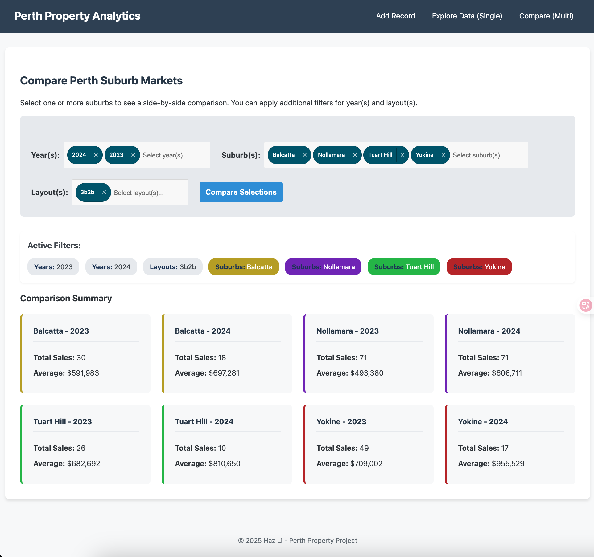

# Perth Property Market - Full Stack Data Analysis & BI Web App

This repository documents an end-to-end data analysis project, evolving from a raw dataset to a fully interactive Business Intelligence (BI) web application for exploring the Perth real estate market.

**Live Application (Example URL):**

## 1. Project Overview & Objectives

This project was conceived as a comprehensive portfolio piece to demonstrate a wide range of data-centric skills, including:

- **Data Engineering:** Designing a robust relational database schema and building an automated ETL pipeline to clean, transform, and load raw data.
- **Backend Development:** Creating a powerful API and server-side logic using Python and Flask to handle complex, data-driven requests.
- **Frontend Development:** Building a user-friendly, responsive, and interactive user interface with HTML, CSS, and modern JavaScript to present data insights.
- **Data Analysis & BI:** Providing users with powerful tools to perform multi-dimensional analysis, compare market segments, and derive actionable insights from the data.

## 2. Tech Stack

| Category               | Technology / Library                                            |
| ---------------------- | --------------------------------------------------------------- |
| **Programming**        | Python 3.10+                                                    |
| **Backend**            | Flask                                                           |
| **Database**           | MySQL                                                           |
| **DB Interface (ORM)** | SQLAlchemy, PyMySQL                                             |
| **Data Manipulation**  | Pandas                                                          |
| **Frontend**           | HTML5, CSS3, JavaScript                                         |
| **JS Libraries**       | Choices.js (for searchable dropdowns), Google Maps API (Places) |
| **Development**        | Jupyter Notebook, VS Code, Git, MySQL Workbench                 |
| **Environment**        | `python-dotenv` for secret management                           |

## 3. Data Engineering: The ETL Pipeline & Database

The foundation of this application is a well-structured relational database populated by a reproducible ETL process.

### 3.1. Database Schema Design

A **Star Schema** was designed and implemented in MySQL. This model separates descriptive attributes (Dimensions) from core transactional data (Facts), ensuring data integrity and optimizing analytical query performance.

- **Fact Table:** `FACT_Properties` (Stores core metrics like price, land size, dates, and foreign keys)
- **Dimension Tables:**
  - `DIM_Suburbs` (Unique suburbs and postcodes)
  - `DIM_Agencies` (Unique real estate agencies)
  - `DIM_Layouts` (Unique combinations of bedrooms & bathrooms)
  - `DIM_Primary_Schools` & `DIM_Secondary_Schools` (Decoupled school dimensions with ICSEA scores)

_(The full DDL script is available in `sql/create_tables.sql`.)_

### 3.2. The ETL (Extract, Transform, Load) Process

A Python script, initially prototyped in a Jupyter Notebook, performs the following automated steps:

1.  **Extract:** Loads the raw `perth_housing.csv` and a custom `corrections.csv` for auditable manual fixes.
2.  **Transform:**
    - **Data Sanitization:** A critical step that standardizes key text fields (e.g., Suburb, Agency) by stripping whitespace and enforcing a consistent lowercase format to prevent data duplication.
    - **Type Conversion:** Converts date columns to `datetime` objects.
    - **Feature Engineering:** Creates powerful interaction features like `Layout` ('3b2b') from existing data.
3.  **Load:** Populates the five `DIM_` tables with unique, sanitized data, then uses the returned primary keys to populate the central `FACT_Properties` table, correctly establishing all relationships.

## 4. Full Stack Web Application

The core of this project is an interactive Flask web application that serves as a BI dashboard.

### 4.1. Feature: Data Entry (`/add`)

A user-friendly form for adding new property records, featuring:

- **Address Autocomplete:** Integrates the **Google Maps Places API** to provide real-time address suggestions and auto-fill Suburb and Postcode information, significantly improving user experience and data quality.
- **Searchable Dropdowns:** Implements **Choices.js** for long lists like Agency and Schools, allowing users to find options by typing.
- **Robust Validation:** Employs both client-side (HTML5) and server-side (Flask) validation to ensure data integrity (e.g., checking for unique Listing IDs).
- **Mock Mode:** A toggleable mode that allows testing the form's functionality by saving data to a temporary in-memory list instead of the live database.

### 4.2. Feature: Multi-Dimensional Comparison (`/compare`)

The main analytical engine of the application, allowing users to:

- **Filter by Multiple Dimensions:** Select one or more **Suburbs**, **Years**, and **Layouts** to create highly specific market segments for analysis.
- **Dynamic Granularity:** The application intelligently aggregates and groups data based on the user's selections. A query for (2 Suburbs x 3 Years) will generate 6 unique summary cards, providing precise, non-aggregated insights.
- **Dynamic Color-Coding:** A sophisticated algorithm based on the **Golden Ratio** assigns a unique and visually distinct color to each selected suburb. This color is used consistently in filter tags and result cards, dramatically improving data readability.
- **Clear & Responsive UI:** An "Active Filters" bar provides context for the results, which are displayed in a fully responsive CSS Grid layout that adapts from 4 columns on desktop to a single column on mobile.

## 5. Future Work & Potential Enhancements

- **Interactive Charts:** Replace the static summary cards in the `/compare` view with interactive charts (using Chart.js) to visualize price trends.
- **Map Integration:** Add a new page that uses the longitude/latitude data and a mapping library (like Leaflet.js or Google Maps) to display properties geographically.
- **Machine Learning Model:** Build, train, and integrate a price prediction model (e.g., RandomForest, XGBoost) and create a `/predict` page where users can get an estimated value for a new property.
- **Deployment:** Deploy the final application to a cloud service like Heroku or AWS.
