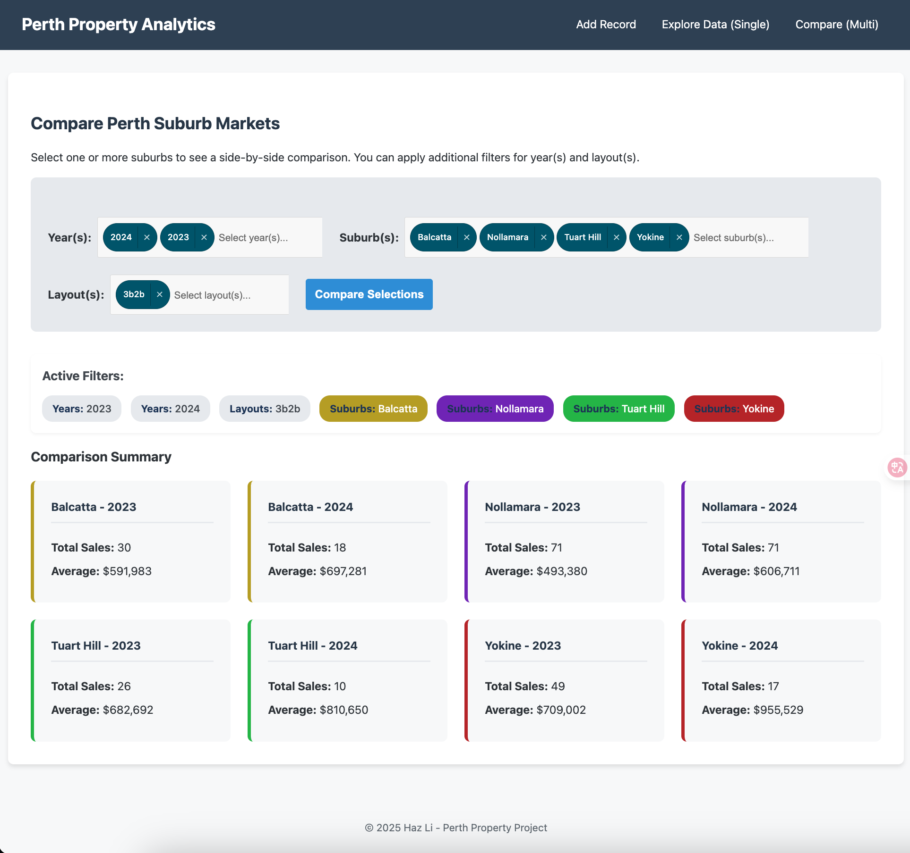

# Perth Property Market - Full Stack Data Analysis & BI Web App

This repository contains the source code for a comprehensive, end-to-end data science project that analyses Perth real estate market. The project evolves from a raw dataset into a fully deployed, interactive Business Intelligence (BI) web application.

**🚀 Live Application (URL):** **https://perth-property-app.onrender.com**

## 1. Project Overview & Objectives

This project was built as an end-to-end portfolio piece to demonstrate a full spectrum of data science and web development capabilities. It features a live, interactive web application with three core analytical tools:

- **📈 Multi-Dimensional Market Comparison (`/compare`):** A powerful BI dashboard where users can perform side-by-side comparisons of market statistics. It allows for multi-selection across various dimensions like **Suburb**, **Year**, and **Layout**, and uses a dynamic color-coding system to enhance visual association and readability.

- **🗺️ Interactive GIS Map (`/map`):** A geospatial analysis tool built with Leaflet.js. It visualizes thousands of property sales using Marker Clustering for performance. Crucially, it features **on-demand, asynchronous loading** of school data layers, allowing users to visually correlate property locations with the quality of nearby schools—a key value driver identified by our ML model.

- **🏡 Comparative Market Estimator (`/cma`):** A transparent and trustworthy value estimation tool. Instead of deploying a "black box" model, this feature uses the **Comparative Market Analysis (CMA)** method. It queries the database for recently sold, directly comparable properties based on the most critical features (`Suburb`, `Layout`, etc.) that were identified during an initial machine learning exploration phase.

## 2. Tech Stack & Architecture

| Category          | Technology / Library                                   |
| ----------------- | ------------------------------------------------------ |
| **Programming**   | Python 3.13.2                                          |
| **Backend**       | Flask, Gunicorn                                        |
| **Database**      | MySQL (Cloud-hosted on **Railway.app**)                |
| **DB Interface ** | SQLAlchemy, PyMySQL                                    |
| **Data Science**  | Pandas, Scikit-learn, Joblib                           |
| **Frontend**      | HTML5, CSS3, JavaScript                                |
| **JS Libraries**  | Choices.js, eaflet.js, Leaflet.MarkerCluster, Chart.js |
| **APIs**          | Google Maps API (Places, Geocoding, Maps JavaScript)   |
| **Development**   | **Render** (Web Service), Git                          |
| **Environment**   | `python-dotenv` for secret management                  |

---

## 3. Data Engineering & ETL Pipeline

The application is powered by a robust ETL process and a well-structured relational database.

- **Database Schema:** A **Star Schema** was implemented in MySQL, separating transactional data (`FACT_Properties`) from descriptive attributes (`DIM_Suburbs`, `DIM_Layouts`, etc.) to ensure data integrity and optimize analytical queries. _(Full DDL in `sql/create_tables.sql`)_.

- **ETL Process:** An automated Python script performs the end-to-end ETL workflow:
  1.  **Extract:** Loads data from the raw CSV and a manual `corrections.csv`.
  2.  **Transform:** Sanitizes text data, converts types, and engineers features.
  3.  **Enrich!!!:** A key step where a separate script (`geocode_schools.py`) uses the **Google Places API** to find and backfill missing latitude/longitude coordinates for all schools.
  4.  **Load:** Populates the cloud-hosted MySQL database on Railway.

---

## 4. Machine Learning for Insight Generation

A full machine learning workflow was conducted in the `model_training.ipynb` notebook and all assets are archived in `ml_artifacts/`. A key phase involved building a `RandomForestRegressor` model (`R² ≈ 0.80`) not for direct prediction, but as a powerful **exploratory tool** to uncover the true drivers of property value.

### 4.1. The Core Insight: What Truly Matters?

The model's **feature importance** analysis provided a clear, data-driven answer: the most critical factors for predicting price are, in order, **`suburb_name`**, **school quality (ICSEA)**, **`property_type`**, and the specific **`layout`** (bedrooms/bathrooms).

### 4.2. The Strategic Pivot: From "Black Box" to a Trustworthy Tool

While the ML model was accurate, a "black box" prediction can be difficult for users to trust. Therefore, a strategic decision was made to use the model's insights to build a more transparent and intuitive tool.

The final **Value Estimator (`/cma`)** is a direct result of this. It is a **Comparative Market Analysis (CMA)** tool whose filters are precisely the key features our ML model identified as most important. It provides an explainable estimation based on the median price of recent, directly comparable sales.

This approach combines the insight-generating power of machine learning with the trustworthiness of a traditional, rule-based valuation method, delivering a final product that is both smart and transparent.

---

## 5. Deployment & CI/CD

The application is fully deployed to the cloud, following modern DevOps practices.

- **Database:** The MySQL database is hosted on **Railway.app**.
- **Web Service:** The Flask application is deployed as a Web Service on **Render**.
- **Continuous Deployment:** Render is connected to the `main` branch of this GitHub repository. Every `git push` to `main` automatically triggers a new build and deployment, ensuring the live application is always up-to-date.
- **Configuration:** All sensitive information (Database URLs, API Keys) is securely managed as **Environment Variables** in Render, and are never hard-coded in the source.

---
